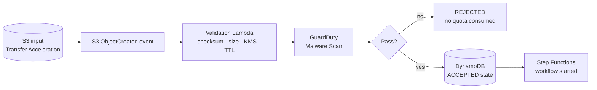
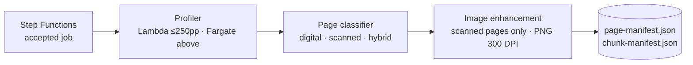
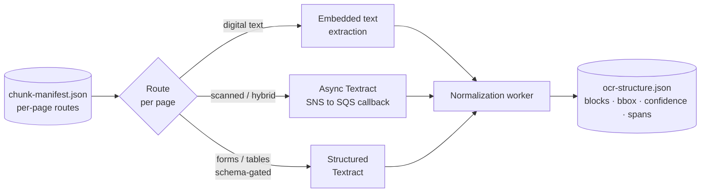
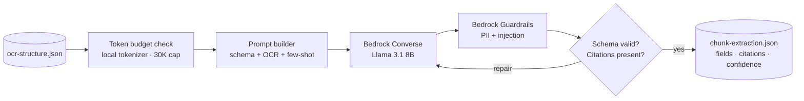
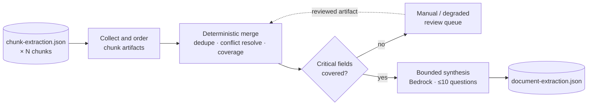
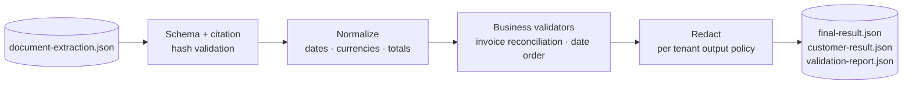
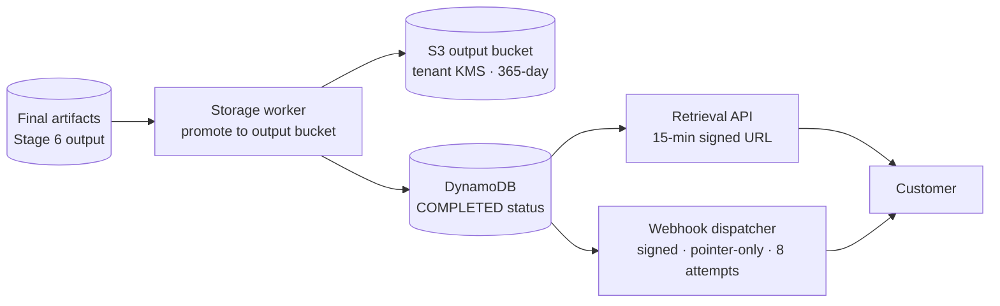

# Artifact 1 — Proposed Architecture

> **In one sentence:** A serverless, event-driven AWS pipeline that processes PDFs up to 1,000 pages and 300 MB through seven durable stages — using the cheapest reliable path for each page, citation-grounded LLM extraction for accuracy, and deterministic logic for every consequential decision.
>
> **Related artifacts:** Artifact 2 covers operations (SLOs, dashboards, alerts, runbooks). Artifact 3 covers security and compliance posture. Artifact 4 covers risk mitigation. Decisions and assumptions referenced here are tracked in `ddr.md` and `assumptions.md`.

## 1. What We Are Building and How

We are building an AWS-native Document AI platform that accepts large PDFs, processes them asynchronously through a seven-stage pipeline, and delivers structured JSON extraction results through an API and webhook.

**The engineering bet:** *The language model is used only where it adds value — extracting fields from text. Deterministic code owns every consequential decision: whether a citation is valid, whether an invoice total reconciles, whether redaction applies, and whether a critical conflict can be auto-resolved.*

**Core approach in one paragraph:** A customer uploads a PDF directly to S3. The platform validates it, splits it into token-aware chunks, and processes each chunk in parallel — bypassing OCR for pages that already have embedded text, running asynchronous OCR only for scanned or hybrid pages, and calling a language model only for schema-constrained extraction. Chunk results are merged deterministically. Every state transition is durable, every artifact is versioned, and every stage is replayable without duplicating work or charges.

The design is managed-first. Version 1 uses AWS managed services throughout and defers the self-hosted GPU path until sustained volume proves the economics. All infrastructure is defined in AWS CDK with Python and deployed through GitHub Actions with quality gates.

---

## 2. Case Study Interpretation and Scope

The case study asks for a serverless, event-driven, API-driven platform capable of processing large PDFs at high throughput while controlling latency, cost, reliability, security, and MLOps risk.

**What this design handles:**

- PDF documents up to 1,000 pages and 300 MB.
- Document types: invoices, contracts, forms, and corporate reports.
- Sustained throughput of 10,000+ documents per day.
- Burst intake up to 50,000 documents, protected by queues, admission control, and per-tenant rate limits.
- P95 end-to-end latency under 5 minutes for accepted documents.
- Cost below $0.10 per 100 pages for a representative document mix.
- 99.9% platform availability through durable state, retries, DLQs, and replay.
- GDPR and SOC 2-aligned security, encryption, auditability, and erasure.
- Managed Bedrock inference in v1 with a defined self-hosted EKS path for high-volume economics.

**Important scope clarifications:**

- The 5-minute SLA clock starts at `accepted_at` — after the platform has received, validated, and malware-scanned the uploaded object. Upload time over customer networks is excluded.
- The $0.10 cost target is for a representative mix (~60% digital-text, ~30% hybrid, ~10% scanned). Fully-scanned or form-heavy documents can exceed the target and are surfaced as policy exceptions, not silent overruns.
- The case study lists Merging before AI Extraction. This design inverts the order because merge requires chunk-level extracted fields. The mapping is made explicit below.

**Case study stage mapping:**

| Case study stage | Architecture stage | Note |
|---|---|---|
| Ingestion | Stage 1 | Create job, upload to S3, validate, accept. |
| Pre-processing | Stage 2 | Profile PDF, classify pages, enhance, chunk. |
| OCR & Structure Extraction | Stage 3 | Produce citation-ready text and layout artifacts per chunk. |
| AI Extraction | Stage 4 | Extract schema-valid chunk JSON with citations. |
| Merging | Stage 5 | Merge chunk artifacts; bounded synthesis for cross-chunk fields only. |
| Post-processing | Stage 6 | Validate, normalize, redact, package final JSON. |
| Storage | Stage 7 | Persist results, update terminal status, notify via webhook. |

---

## 3. Assumptions

The following assumptions underpin the cost model, latency targets, and operational metrics. They are not defaults — changing them requires re-running the relevant calculations.

| # | Area | Assumption |
|---|---|---|
| A1 | Region | Primary AWS region is `us-east-1`. |
| A2 | SLA clock | The 5-minute P95 clock starts at `accepted_at`. Upload time is excluded. |
| A3 | File limits | PDFs up to 300 MB and 1,000 pages per document. |
| A4 | Throughput | 10,000+ docs/day sustained; 50,000-document burst. |
| A5 | Document mix | ~60% digital-text (OCR bypass), ~30% hybrid (selective OCR), ~10% fully scanned. Form-heavy workloads are cost-policy exceptions. |
| A6 | Upload | Direct S3 presigned POST with Transfer Acceleration. 30-minute upload TTL. Customers never push files through Lambda. |
| A7 | Malware scan | GuardDuty Malware Protection scan completes in seconds for typical files; budgeted at under 30 seconds worst case. |
| A8 | Ingestion cost | S3 Transfer Acceleration ~$0.04/GB; GuardDuty ~$0.09/GB + $0.215/1K objects. Ingestion total: under $0.04 per 300 MB document. |
| A9 | Pre-processing | Stage 2 completes in under 30 seconds for typical digital/mixed PDFs. Lambda for ≤250 pages / ≤100 MB; Fargate above that. |
| A10 | Token estimation | 1 token ≈ 4 characters + 20% safety margin. Model-agnostic and conservative by design. |
| A11 | OCR pricing | Platform will exceed 1M Textract pages/month, qualifying for volume pricing: $0.0010/page (text/tables), $0.0040/page (forms/key-value). |
| A12 | OCR callback | Textract async callback within 10 seconds–2 minutes for typical chunks; 3-minute poll fallback. |
| A13 | OCR concurrency | Starting defaults: 100 global active OCR units, 5 per tenant, 2 per job. Must be load-tested against Textract quotas before launch. |
| A14 | Model pricing | Llama 3.1 8B on Bedrock: $0.22/1M tokens (input and output). Llama 3.1 70B: $0.72/1M tokens. On-demand rates. |
| A15 | Chunk economics | Typical 100-page document → ~4 chunks × 19.2K tokens. Stage 4 cost: ~$0.017/100 pages with 8B model. 70B recovery on all chunks: ~$0.055 — above stop-loss, confirming it must be selective. |
| A16 | Token budget | ≤25K target input, 30K hard cap, ≤1.5K output, ≤4K few-shot examples per chunk. |
| A17 | Merge cost | Deterministic merge: ≤$0.001/100 pages. Synthesis: ≤$0.010/100 pages. Summaries skipped when synthesis would breach the $0.025 stop-loss. |
| A18 | Synthesis cap | ≤20K input tokens, 30K hard cap, maximum 10 synthesis questions per document. |
| A19 | Post-processing | Stage 6 cost: ≤$0.001/100 pages. Hard stop-loss at $0.005 indicates retry storms or config bugs. |
| A20 | Storage & delivery | Stage 7 cost: ≤$0.001/100 pages storage + ≤$0.001/job for webhook and index. |
| A21 | Webhook delivery | 8 attempts max over 24 hours, exponential backoff with jitter, 5-second timeout per attempt. |
| A22 | Signed URL TTL | 15-minute default. Customer must re-call the API after expiry. |
| A23 | Retention | Inputs and final outputs: 365-day default. Original inputs cold-tiered after 7 days. Enhanced images deleted after 24 hours. Rejected uploads: 7 days warm + 21 days cold. |
| A24 | Self-hosted break-even | vLLM with INT8/FP8 on g5.xlarge (A10G) achieves ≥825 tokens/sec at 80% GPU utilization. Fixed infrastructure baseline: ~$1,453/month (2× reserved g5.xlarge + EKS overhead). Break-even: ~5,500–6,000 docs/day; recommended switch at ~10,000 docs/day for sufficient cost-savings margin. |

---

## 4. Architecture Overview

The platform is structured as nine vertical layers. Each layer is responsible for one concern, produces a durable artifact, and hands off to the next layer through a versioned contract. Every layer is independently replayable.

```mermaid
flowchart LR
    Client[Customer system] --> API[API Gateway + WAF]
    API --> Auth[API key + JWT authorizer]
    Auth --> Job[Submission Lambda]
    Job --> DDB[(DynamoDB<br/>job state + idempotency)]
    Job --> Post[Presigned S3 POST<br/>30 min TTL]
    Client --> S3In[(S3 input bucket<br/>Transfer Acceleration)]

    S3In --> S3Event[S3 ObjectCreated event]
    S3Event --> Validate[Validation Lambda]
    Validate --> Malware[GuardDuty Malware Protection<br/>for S3]
    Validate --> Accept{Accepted?}
    Accept -- no --> Reject[Rejected / Quarantined<br/>no processing quota]
    Accept -- yes --> SFN[Step Functions Standard<br/>parent workflow]

    SFN --> Prep[Stage 2<br/>Pre-process]
    Prep --> Profile[Profile PDF<br/>page quality + structure]
    Profile --> Manifests[(Page + chunk manifests)]

    Manifests --> Map[Distributed Map<br/>bounded chunk fan-out]
    Map --> OCR[Stage 3<br/>OCR + structure]
    OCR --> Textract[Async Textract<br/>SNS to SQS callback]
    OCR --> Direct[Direct text extraction<br/>OCR bypass]
    Textract --> OCRArtifact[(ocr-structure.json)]
    Direct --> OCRArtifact

    OCRArtifact --> Extract[Stage 4<br/>AI extraction]
    Extract --> Bedrock[Bedrock Converse<br/>tool-use JSON output]
    Extract --> Guardrails[Bedrock Guardrails<br/>PII + injection controls]
    Bedrock --> ChunkJSON[(chunk-extraction.json<br/>with citations)]

    ChunkJSON --> Merge[Stage 5<br/>merge + bounded synthesis]
    Merge --> Review{Manual / degraded<br/>review needed?}
    Review -- yes --> ManualQ[Manual or degraded<br/>review queue]
    ManualQ --> Merge
    Review -- no --> DocJSON[(document-extraction.json)]

    DocJSON --> PostProcess[Stage 6<br/>validate + normalize + redact]
    PostProcess --> FinalPkg[(final-result.json<br/>customer-result.json<br/>validation-report.json)]

    FinalPkg --> Store[Stage 7<br/>storage + retrieval + notification]
    Store --> S3Out[(S3 output bucket<br/>tenant KMS)]
    Store --> Status[(DynamoDB<br/>terminal status)]
    Store --> ResultAPI[Result API<br/>signed URL]
    Store --> Webhook[Signed pointer webhook]

    SFN -. audit events .-> Audit[(Immutable audit bucket<br/>S3 Object Lock)]
    API -. traces/metrics .-> Obs[CloudWatch + X-Ray<br/>Prometheus/Grafana for GPU path]
    SFN -. usage ledger .-> Cost[(Per-job cost ledger)]
```



**Service layer summary:**

| Layer | Key AWS services | Responsibility |
|---|---|---|
| API & Admission | API Gateway, WAF, Lambda | Authenticate, create jobs, issue upload policies, enforce intake fairness |
| State & Storage | S3, DynamoDB, KMS | Artifact storage, job state, cryptographic tenant isolation |
| Orchestration | Step Functions, SQS, EventBridge | Coordinate stages, fan out chunks, buffer bursts, make work replayable |
| Document Processing | Lambda, ECS/Fargate, Textract | Profile PDFs, enhance images, OCR selected pages, normalize artifacts |
| AI Extraction | Bedrock Converse, Guardrails, Knowledge Bases | Extract schema-valid chunk JSON with citations and hallucination controls |
| Quality Gates | Merge workers, validators, review queues | Resolve conflicts, validate citations and totals, route unsafe outputs |
| Delivery | S3 output, API Gateway, webhook dispatcher | Store final result, expose signed URL, send pointer-only notifications |
| Observability | CloudWatch, X-Ray, Firehose, Prometheus, Grafana | Trace, monitor, audit, alert, and compare managed vs self-hosted inference |

---

## 5. Requirements Traceability

The case study contains hard requirements across functional, non-functional, MLOps, and security domains. The table below confirms how each is addressed.

| Case study requirement | How the design addresses it |
|---|---|
| Serverless, API-driven, event-driven | Every stage is Lambda or Fargate triggered by events. No polling. Heavy PDFs use Fargate; simple work stays in Lambda. |
| Large PDF uploads (up to 300 MB) | Direct S3 presigned POST with Transfer Acceleration. File never passes through Lambda or API Gateway. |
| Documents up to 1,000 pages | Stage 1 validates page count before quota is consumed. Stage 2 uses Fargate for documents above the Lambda cutoff. |
| 20–50 page chunks | Stage 2 chunks by page range, document structure, and token budget. Token-aware chunking prevents LLM context overflow. |
| Orientation/image enhancement | Stage 2 detects rotation, skew, and quality. Enhancement runs only on pages that need OCR — digital-text pages are never rasterized. |
| Asynchronous OCR | Stage 3 uses Textract async APIs with SNS→SQS callbacks, bounded retries, DLQ, and SNS signature validation. |
| Text, forms, and tables | Direct text is default. Raw OCR is fallback. Structured Textract (Forms/Tables) is schema-gated. Forms cost $0.0040/page vs $0.0010/page for text — enabling them by default would breach the $0.10 target. |
| SLM/LLM for classification and entity extraction | Stage 4 uses Bedrock Llama 3.1 8B via Converse API with tool-use JSON output. 70B is reserved for critical recovery. |
| 128K context window limit | The system never places the full document in one prompt. Token-aware chunks with a 30K hard cap ensure every prompt fits safely within the model context, leaving headroom for schema, instructions, citations, and repair prompts. |
| Merge chunk outputs | Stage 5 merges chunk artifacts deterministically using schema-defined merge policies for each field. |
| Cross-page reasoning | Stage 5 synthesis is bounded to ≤10 targeted questions. The model receives only relevant candidates and source spans, not the full document. |
| Structured JSON output | Stage 6 produces `customer-result.json` as the customer-facing output. `final-result.json` and `validation-report.json` are platform-internal. |
| Job status and result retrieval API | `GET /v1/jobs/{id}` returns status and metadata. `GET /v1/jobs/{id}/result` returns a 15-minute signed URL for `customer-result.json`. |
| Webhook without large payloads | Stage 7 sends HMAC-SHA256-signed pointer-only webhooks for all terminal states. No extracted values, raw text, PII, or presigned S3 URLs in webhook payloads. |
| 10,000 docs/day sustained | Admission control, Distributed Map, per-tenant concurrency limits, and service quota guardrails shape load. |
| 50,000-document burst | SQS and EventBridge decouple ingestion from processing. Tenant token buckets and per-stage concurrency limits prevent burst from overwhelming OCR, Bedrock, or DynamoDB. |
| Sub-5-minute P95 latency | Explicit stage budgets: Stage 2 ≤30s, Stage 3 P95 ≤180s, Stage 4 P95 ≤60s, Stage 5 P95 ≤30s, Stage 6 P95 ≤10s, Stage 7 P95 ≤10s. Queue age alarms trigger backpressure before SLA misses. |
| Less than $0.10 per 100-page document | Cost is controlled per stage. Representative-mix estimate: ingestion ~$0.04, OCR ~$0.01–0.03, Stage 4 extraction ~$0.017, merge/synthesis ~$0.011, post-processing and delivery ~$0.003. Scanned-heavy workloads are surfaced as exceptions via `cost_policy_result` tracking. |
| 99.9% availability | Durable Step Functions state machine, SQS with DLQs, retry with exponential backoff and jitter, poison-pill isolation, and replay at document, chunk, OCR unit, model invocation, merge, and webhook scope. |
| Idempotency | Every asynchronous boundary has a scoped idempotency key incorporating job, chunk, artifact hash, policy version, and model route. Retries and replays cannot create duplicate billing events, OCR charges, or webhook deliveries. |
| Poison-pill handling | Repeated deterministic failures move to isolated poison queues with non-PII diagnostics, attempt count, failure reason codes, and operator replay paths. |
| AWS KMS CMK encryption at rest | Every customer document, intermediate artifact, and output uses a per-tenant CMK. Without the tenant key, artifacts are unreadable. |
| 365-day data retention | Stage 7 applies a 365-day default lifecycle policy. Original inputs are cold-tiered after 7 days. Tenant policy can shorten or extend within contract terms. |
| GDPR alignment | GDPR deletion workflow (Stages 1 and 7) deletes customer content and can crypto-shred via tenant key deletion. PII-free immutable audit records survive erasure by design. |
| SOC 2 alignment | Immutable audit via S3 Object Lock in compliance mode, CloudTrail API logging, CI/CD change-management evidence, and canary deployment controls. |
| PII protection in logs | Emit-time log scrubbing with pattern-based redaction. CloudWatch subscription filter feeds a Comprehend-backed inspection Lambda for leakage detection. |
| AWS X-Ray distributed tracing | X-Ray traces propagate correlation ID, tenant ID, job ID, chunk ID, and stage across all Lambda, Fargate, Textract, Bedrock, and DynamoDB calls. |
| IaC with AWS CDK Python | All infrastructure — application, data, observability, security, and inference — is defined in AWS CDK with Python and validated through CDK synth in CI. |
| GitHub Actions CI/CD with 80% coverage | GitHub Actions pipeline runs build, lint, unit tests (≥80% coverage), security checks, CDK synth validation, integration tests, and deployment. |
| Precision/Recall/F1 tracking | Stage 4 and Stage 5 evaluate document-level, field-level, and critical-field F1. Quality is tracked by document type, schema, page quality, OCR route, and model version. |
| 10% canary rollouts with 1-hour soak | Canary releases are used for application code, prompts, schemas, merge policies, and model versions. Rollback criteria include critical-field F1, schema validation failure rate, cost spikes, and latency. |
| GPU orchestration (Karpenter/KEDA) | Section 7 describes the EKS self-hosted path with Karpenter GPU node provisioning and KEDA scaling from queue depth and vLLM request backlog. |
| Managed vs self-hosted break-even | Section 7 provides the full quantitative break-even analysis. The recommended transition point is ~10,000 docs/day. |

---

## 6. Layer Details

### 6.1 Ingestion and Acceptance



Job creation and file upload are separated. The customer calls `POST /v1/jobs` to get a presigned S3 upload target, then uploads the PDF directly to S3. The platform never proxies the file through Lambda.

After upload, S3 triggers validation automatically. The Validation Lambda checks object ownership, checksum, content type, file size, page count, KMS key, upload TTL expiry, and the GuardDuty malware scan result. Only after all checks pass does the job move to `ACCEPTED`, tenant quota is consumed, and the Step Functions workflow starts.

Failed uploads do not consume quota. Tenant admission control returns `429` with retry guidance and `Retry-After` headers. Four separate rate limits protect different resources: job creation rate, pending upload count, accepts-per-minute (rate into expensive processing), and maximum concurrent active jobs.

### 6.2 Pre-processing



Stage 2 creates the manifests that drive all downstream parallelism. It runs in Lambda for smaller documents (≤250 pages / ≤100 MB) and ECS/Fargate for anything heavier.

The page classifier is deterministic in v1 — it uses text density, image coverage, dictionary-word ratio, language confidence, orientation, and skew. Ambiguous pages default to the OCR path because missing a critical field is worse than paying for an unnecessary OCR call. A lightweight ML classifier is deferred to v2 once production-labeled examples are available.

Each chunk is bounded by both page count (20–50 pages) and token budget (25K target, 30K hard cap). This is the key control that ensures the downstream LLM never receives a prompt it cannot handle.

### 6.3 OCR and Structure Extraction



Stage 3 collects text from the cheapest reliable source for each page. Digital-text pages skip OCR entirely — this is the primary cost control for documents with embedded text. Scanned and hybrid pages go through async Textract.

Structured OCR (Forms/Tables) is schema-gated. At $0.0040/page for form extraction vs $0.0010/page for text, enabling structured OCR by default on all pages would consume the entire $0.10 budget on Textract alone before the model is even called.

Every Textract call uses `OutputConfig` to write results to the tenant-scoped S3 prefix with the tenant KMS key. Without this, Textract may write outside the tenant isolation boundary. Callbacks are validated against SNS signing certificates, expected topic ARN, job ID, tenant/chunk match, and a freshness window.

The output `ocr-structure.json` preserves page number, reading order, block IDs, bounding boxes, confidence scores, and source spans. These are the citation anchors for everything downstream.

### 6.4 AI Extraction



Stage 4 uses Bedrock Llama 3.1 8B with Converse tool-use to produce one schema-valid JSON artifact per chunk. The Converse tool-use model (`submit_extraction` tool generated from the tenant JSON Schema) forces structured output — free-form model text is ignored.

The core hallucination control is citation enforcement. Every non-null extracted field must carry a `source_citations` array pointing to a specific page, block, and character span from `ocr-structure.json`. If a value has no valid citation, it is rejected and marked `not_found`. The model can say a field is absent, but it cannot invent a value to satisfy a required schema field.

If schema validation or citations fail, the system retries once with a compact repair prompt. If critical fields still fail, the chunk routes to Llama 3.1 70B recovery. If that fails, it routes to manual inspection.

### 6.5 Merge and Document-Level Synthesis



Stage 5 merges chunk artifacts using schema-defined merge policies. Every field declares its cardinality, criticality, merge strategy, and conflict policy. The merge is deterministic first — collecting candidates, deduplicating, normalizing, and applying the field strategy without touching the model.

Invoice total conflicts, critical singleton conflicts, and uncited critical fields always go to manual inspection. The model is not allowed to guess a critical value that multiple high-confidence candidates disagree on.

Bounded synthesis is used only when the schema declares it or Stage 4 flagged a cross-chunk dependency. The synthesis prompt contains only the relevant candidates and source spans, never the full document. Maximum 10 synthesis questions per document, with overflow routed to manual inspection.

### 6.6 Post-processing



Stage 6 is entirely deterministic. It validates the merged document against the tenant JSON Schema, normalizes field values (ISO-8601 dates, ISO-4217 currencies, format-preserving identifiers), runs business validators (invoice reconciliation, date ordering, signature presence), applies tenant redaction rules, and packages the three output artifacts.

Stage 6 does not call the model. If it detects a recoverable issue, it emits one bounded replay request to Stage 4 or Stage 5 — maximum one replay per target stage per job. Recurring failures route to manual inspection rather than triggering unbounded automated retry loops.

Redaction runs after validation, never before. Validators need real values to check totals and identifiers. If redaction fails for any field, the entire output is blocked — unredacted data is never delivered to customers.

### 6.7 Storage, Retrieval, and Notification



Stage 7 promotes Stage 6 artifacts to the durable output bucket, updates the terminal job state, and triggers webhook delivery. The terminal state is marked only after `customer-result.json` is durably written and indexed.

Retrieval always returns a short-lived signed URL, never an inline result body. This keeps the API response shape consistent whether the result is 10 KB or 10 MB. Webhooks are pointer-only — they contain a retrieval URL, a hash, and status metadata, not extracted values. Webhook delivery is decoupled from the job result: a customer endpoint being down does not roll back a completed extraction.

### 6.8 Cross-Cutting Controls

**Idempotency:**

| Stage | Idempotency key |
|---|---|
| Job creation | `tenant_id + client_request_id + request_hash` |
| Upload validation | Object key hash → one job; duplicate S3 events are no-ops |
| OCR | `tenant_id + job_id + chunk_id + ocr_unit_id + ocr_policy_version + input_artifact_hash` |
| AI extraction | `tenant_id + job_id + chunk_id + extraction_unit_id + schema_version + prompt_version + model_route + input_artifact_hash` |
| Merge | `tenant_id + job_id + schema_version + merge_policy_version + ordered_chunk_artifact_hashes` |
| Post-processing | `tenant_id + job_id + schema_version + post_processing_policy_version + stage5_artifact_hash + output_policy_hash` |
| Storage/webhook | `tenant_id + job_id + post_processing_attempt_id + final_result_hash` |

**Multi-tenancy and isolation:**

- Tenant identity is resolved from API key and JWT claims, never trusted from the request body.
- S3 object keys are platform-generated and tenant/job-scoped. Customers cannot influence key structure.
- Per-tenant KMS CMKs provide cryptographic isolation: no cross-tenant artifact is readable without the tenant's key.
- DynamoDB uses high-cardinality `JOB#<job_id>` partition keys with write-sharded tenant GSIs to avoid hot partitions during bursts.
- Schemas, prompts, quotas, cost ledger, and metrics are all scoped by tenant.

**Rate limiting and backpressure:**

- WAF rate limits protect public endpoints.
- API Gateway and Lambda authorizer enforce per-tenant rate limits at job creation.
- Stage 3 and Stage 4 have separate global, per-tenant, and per-job concurrency limits for OCR and Bedrock calls.
- Queue age is an SLA risk signal: when queue age threatens the P95 budget, the platform applies admission backpressure and returns `429 Retry-After` for new work.

**Security and compliance:**

- S3 denies non-TLS access with `aws:SecureTransport=false`. API Gateway uses TLS 1.2+.
- All audit events flow through EventBridge and Firehose to S3 Object Lock in compliance mode. Audit records store only operational facts, hashes, and status codes — never document text or PII.
- GDPR erasure deletes or crypto-shreds customer content while preserving the PII-free audit trail, which is required for SOC 2.

**Reliability:**

- Every asynchronous boundary uses retry with exponential backoff and jitter.
- DLQs isolate failed work with stage, tenant, job, attempt count, failure reason, and artifact pointers.
- Replay is defined at document, chunk, OCR unit, model invocation, merge, validation, and webhook scope.
- Platform-initiated recovery is non-billable. Customer-requested replay after input or policy changes is billable.

**MLOps:**

- All infrastructure is CDK Python. GitHub Actions enforces ≥80% unit coverage, CDK synth validation, and integration tests on the core job lifecycle.
- Prompts, schemas, merge policies, post-processing policies, and model routes are versioned and independently rollback-able.
- Model quality is evaluated by document-level, field-level, and critical-field precision/recall/F1, tracked by document type, schema, page quality, OCR route, and model version.
- Canary releases use 10% traffic over a 1-hour soak. Rollback criteria include critical-field F1 regression, schema validation failure rate, cost spikes, latency, and manual-inspection rate increase.

---

## 7. Self-Hosted LLM Option

Version 1 uses Bedrock managed inference. This section describes the self-hosted path and the quantitative analysis that drives the decision to switch.

### 7.1 Infrastructure Design

Llama 3.1 8B in FP16 requires ~16 GB VRAM. The NVIDIA A10G GPU (24 GB VRAM) on `g5.xlarge` is the right fit. The platform uses three GPU node tiers managed by Karpenter:

| Tier | Instance | Effective rate | Purpose |
|---|---|---|---|
| Reserved baseline | `g5.xlarge`, 1-year reserved | ~$0.523/hr | Always-on for predictable base load; high availability across AZs |
| Spot burst | `g5.xlarge` spot | ~$0.35/hr | Cost-optimised burst — ~65% cheaper than on-demand |
| On-demand overflow | `g5.xlarge` or `g5.2xlarge` | $1.006/hr | Fallback when spot is unavailable or insufficient |

Karpenter manages node provisioning with a GPU node pool capped at 20 A10G nodes as a cost guardrail. Nodes that have been empty for 5 minutes are drained automatically.

KEDA scales the vLLM deployment from two signals: the SQS extraction queue depth (one message = one chunk awaiting model inference) and the vLLM internal `num_requests_waiting` metric from Prometheus (requests queued inside the model server's KV-cache scheduler). Minimum replicas: 1 (keeps one pod warm). Scale-down cooldown: 5 minutes.

vLLM serves Llama 3.1 8B with **INT8 or FP8 quantization**. This is required: without quantization, the A10G achieves only ~500 tokens/sec, which is more expensive per token than Bedrock. With quantization, the target throughput of ≥825 tokens/sec makes self-hosted competitive.

### 7.2 Observability

Self-hosted metrics are collected by Prometheus and visualized in Grafana. They are normalized to the same `cost_per_1m_tokens` unit used for Bedrock, so the cost comparison panel shows both paths on the same axis in real time.

**GPU and infrastructure metrics:**

| Metric | Source | Purpose |
|---|---|---|
| `DCGM_FI_DEV_GPU_UTIL` | DCGM Exporter | GPU compute utilization per device |
| `DCGM_FI_DEV_FB_USED/FREE` | DCGM Exporter | VRAM used vs free — KV-cache sizing signal |
| `node_provisioning_time_seconds` | Karpenter | Time from scale trigger to node ready |
| `spot_interruption_count` | CloudWatch Events | Spot reclaim rate per instance type |

**vLLM inference metrics:**

| Metric | Purpose |
|---|---|
| `vllm:num_requests_running` | Active concurrent requests — utilization |
| `vllm:num_requests_waiting` | Internal queue depth — KEDA trigger |
| `vllm:gpu_cache_usage_perc` | KV cache hit rate — memory pressure signal |
| `vllm:time_to_first_token_seconds` | TTFT — latency SLO |
| `vllm:prompt_tokens_total` / `vllm:generation_tokens_total` | Token throughput — cost basis |

**Derived cost metric (platform-level):**
```
cost_per_1m_tokens = instance_price_usd_per_hr ÷ (tokens_per_sec × 0.80 × 3600 ÷ 1,000,000)
```
This is recorded under the same `model_route` field used throughout Stage 4, so cost dashboards compare `managed_default` vs `selfhosted_default` without schema changes.

### 7.3 Break-Even Analysis

**Why 825 tokens/sec is the per-token break-even threshold**

At what GPU throughput does the per-token self-hosted cost equal Bedrock's $0.22/1M?

```
$0.523/hr ÷ (T × 0.80 × 3600 / 1,000,000) = $0.22
T = 523,000 ÷ (0.22 × 0.80 × 3600) ≈ 825 tokens/sec
```

Above 825 tokens/sec per reserved A10G, self-hosted is cheaper per token. Below it, Bedrock wins even on reserved instances. This is why quantization is required — without it the A10G achieves only ~500 tokens/sec.

**Volume break-even: at what daily document rate does self-hosted become net cheaper?**

Parameters:
- Tokens per document: 4 chunks × 19.2K tokens = 76,800 tokens
- Bedrock cost per doc: 76,800/1M × $0.22 = $0.01690/doc
- GPU hours per doc (at 825 tok/s, 80% util): 76,800 / (825 × 0.80 × 3600) = 0.03232 GPU-hours
- Fixed infrastructure: ~$1,453/month (2× reserved GPUs + EKS overhead)
- Baseline capacity: 2 GPUs × 720 hrs = 1,440 GPU-hours/month

Setting Bedrock cost equal to self-hosted cost:
```
docs/day × 30 × $0.01690 = $1,453 + (docs/day × 30 × 0.03232 − 1,440) × $0.35
0.1675 × D = $949
D ≈ 5,667 docs/day  →  break-even point
```

**Cost comparison table:**

| Daily volume | Bedrock / month | Self-hosted / month | Monthly saving | Verdict |
|---|---:|---:|---:|---|
| 1,000 docs/day | $507 | $1,453 (fixed floor) | −$946 | Bedrock |
| 3,000 docs/day | $1,521 | ~$1,453 | +$68 | Break-even zone |
| 5,667 docs/day | $2,873 | ~$2,764 | +$109 | Self-hosted (marginal) |
| 10,000 docs/day | $5,069 | $4,343 | **+$726 (14%)** | Self-hosted |
| 20,000 docs/day | $10,138 | $7,737 | **+$2,401 (24%)** | Self-hosted |
| 50,000 docs/day | $25,344 | $17,919 | **+$7,425 (29%)** | Self-hosted |

**Key risks and caveats:**

- The 825 tokens/sec target requires INT8/FP8 quantization and vLLM continuous batching. At 500 tokens/sec (no quantization), break-even jumps above 30,000 docs/day.
- Spot interruptions increase the effective rate. If the platform regularly falls back to on-demand ($1.006/hr), break-even rises to ~20,000+ docs/day.
- Llama 3.1 70B economics are unfavourable on A10G. At ~400 tokens/sec on g5.12xlarge reserved (~$2.95/hr), the per-token cost is ~$2.56/1M — far above Bedrock's $0.72/1M. The 70B recovery model should remain on Bedrock unless A100-class instances at very high utilization are available.
- The analysis assumes production-representative 18K-token input contexts. Shorter contexts produce higher throughput and a lower break-even volume; longer contexts have the opposite effect.

**Recommendation:** Adopt self-hosted Llama 3.1 8B when sustained volume exceeds **10,000 docs/day** and vLLM throughput benchmarks with production-representative prompts confirm ≥825 tokens/sec on the A10G. The 14% cost saving at 10K docs/day provides a meaningful margin to absorb operational variability. Keep Llama 3.1 70B on Bedrock regardless of volume.

---

## 8. Closing Thoughts

The design's reliability comes from keeping it predictable: durable state, explicit artifacts, scoped idempotency keys, bounded retries, and deterministic validation at every quality gate. The model is used where it adds value — extracting fields from text — but deterministic code makes every consequential decision: whether a citation is valid, whether an invoice total reconciles, whether a redaction rule applies, and whether a critical conflict can be auto-resolved.

The most important engineering tension is **cost versus quality**. Running structured OCR and strong models on every page would be simpler but would fail the $0.10 target. The architecture resolves this by routing each page and each field through the cheapest reliable path — digital text before OCR, raw OCR before structured OCR, small model before large model, deterministic merge before synthesis. Cost is visible at every stage and enforced through stop-loss controls, not left as a post-hoc report.

---

## 9. Glossary

| Term | Meaning |
|---|---|
| `accepted_at` | The timestamp when an uploaded document passes all validation and malware checks. The 5-minute SLA clock starts here. |
| Artifact | A versioned, encrypted S3 object produced by one pipeline stage and consumed by the next. |
| Chunk | A bounded group of document pages (20–50 pages) constrained by token budget, used as the unit of parallel OCR and extraction. |
| Citation | A pointer from an extracted field value back to a specific page, block, character span, and bounding box in the OCR output. |
| CMK | Customer-managed KMS key; one per tenant, used to encrypt all customer document data and derived artifacts. |
| DLQ | Dead-letter queue; isolates work that has exhausted its retry budget for operator review and replay. |
| Guardrail | Bedrock control layer that filters PII in model inputs/outputs and blocks prompt injection attempts. |
| Idempotency key | A scoped composite key that uniquely identifies one unit of work; retrying with the same key returns the existing result without duplicating charges. |
| KEDA | Kubernetes Event-Driven Autoscaling; scales vLLM inference pods from queue depth and model-server backlog metrics. |
| Karpenter | Kubernetes node autoscaler; provisions GPU nodes on-demand, on spot, or from reserved capacity as the inference workload changes. |
| Poison pill | A document, chunk, or stage item that repeatedly or deterministically fails; isolated to a separate queue with non-PII diagnostics for operator review. |
| SLO | Service-level objective — a measurable target such as P95 latency ≤5 minutes or webhook delivery success ≥99.5%. |
| TTFT | Time to first token; measures how quickly the model begins producing output, used as the primary inference responsiveness metric. |
| vLLM | High-throughput LLM serving library; uses PagedAttention and continuous batching to maximize GPU utilization and token throughput. |
| Write-sharded GSI | A DynamoDB global secondary index where the partition key includes a random shard suffix to distribute write load during high-throughput bursts. |
