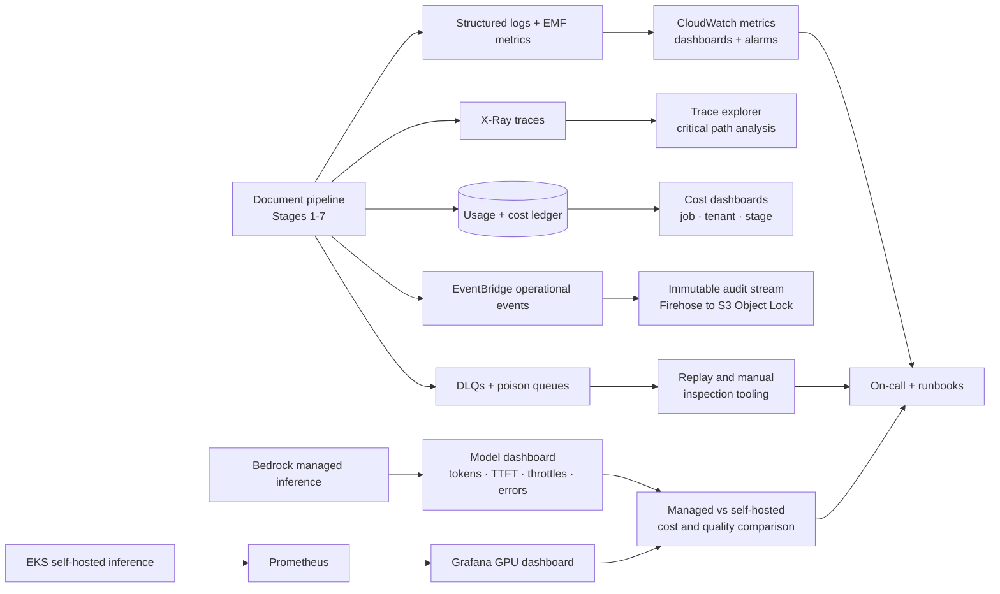

# Artifact 2 — Operational Strategy

> **In one sentence:** Every stage must be measurable, retryable, and stoppable before it damages latency, cost, or downstream capacity — operations is driven by four feedback loops (reliability, latency, cost, quality), five dashboards, and burn-rate alerts that fire on customer impact, not noise.
>
> **Related artifacts:** Artifact 1 describes the system being operated. Artifact 3 covers security operations specifically. Artifact 4 covers risk responses. Stage-level SLOs and metrics are derived from the latency budgets in `ddr.md` and cost targets in `assumptions.md`.

## 1. What We Are Operating

We are operating a high-throughput, asynchronous Document AI platform. The platform is not one long synchronous request. It is a set of durable stages: ingestion, pre-processing, OCR, AI extraction, merge, post-processing, storage, retrieval, and webhook notification.

The operational strategy is built around one principle: every stage must be measurable, retryable, and stoppable before it damages latency, cost, or downstream capacity.

The strategy covers:

- Service health and SLOs.
- Per-stage latency and queue-age monitoring.
- Cost and token usage monitoring.
- OCR, model, and webhook reliability.
- Model quality evaluation.
- Canary release and rollback.
- Incident response and replay.
- Managed Bedrock and future self-hosted GPU inference observability.

## 2. Case Study Interpretation and Scope

The case study asks for an operational plan that can prove the system is healthy while it processes large PDFs, handles bursts, controls cost, and supports managed and self-hosted inference.

This artifact covers:

- How we monitor P95 latency, queue age, throughput, cost, model quality, and GPU metrics.
- How we detect and respond to provider throttling, OCR failures, model failures, poison documents, and webhook failures.
- How we run CI/CD, model evaluation, canaries, and rollback.
- How we operate both the v1 managed Bedrock path and the v2 self-hosted GPU path.

## 3. Operational Assumptions

| Area | Assumption |
|---|---|
| SLA clock | The 5-minute P95 processing clock starts at `accepted_at`, after validation and malware scan. Upload time is excluded. |
| Stage latency budgets | Stage 2 ≤30s, Stage 3 P95 ≤180s, Stage 4 P95 ≤60s, Stage 5 P95 ≤30s, Stage 6 P95 ≤10s, Stage 7 P95 ≤10s. These leave margin within the 5-minute target and drive backpressure decisions. |
| Cost | Representative-mix cost target: ~$0.10/100 pages. Stage breakdown: ingestion ~$0.04, OCR ~$0.01–0.03, Stage 4 extraction ~$0.017, merge/synthesis ~$0.011, post-processing and delivery ~$0.003. Scanned-heavy and form-heavy documents are cost-policy exceptions, not silent overruns. |
| Traffic | 10,000+ docs/day sustained and 50,000-document burst intake. |
| Tenant model | v1 has base-level tenants only, but metrics, quotas, cost, and operational controls are tenant-scoped. |
| Manual review | Critical failures and degraded outputs may require review before customer delivery. Manual-review backlog is an operational SLO input. |
| Model path | Bedrock is v1. EKS/vLLM is the high-volume path; recommended cutover above ~10,000 docs/day when vLLM benchmarks confirm ≥825 tokens/sec on the A10G with production prompts. |
| Deployment | All stacks are CDK Python, deployed through GitHub Actions with tests, security checks, and CDK synth validation. |

## 4. Operational Architecture

Operationally, the system has four feedback loops:

| Loop | Purpose |
|---|---|
| Reliability loop | Detect failures, retries, DLQ growth, poison documents, provider outages, and stuck jobs. |
| Latency loop | Track P50/P95/P99, queue age, slowest required chunk, and end-to-end critical path. |
| Cost loop | Track OCR pages, model tokens, embeddings, storage, observability, retries, and per-tenant spend. |
| Quality loop | Track field accuracy, citation validity, hallucination indicators, manual-review rate, and model drift. |

## 5. Operational Traceability

| Case study requirement | Operational response |
|---|---|
| P95 latency monitoring | Track end-to-end P50/P95/P99 plus stage latency and queue age. Alert on burn rate and queue age before misses occur. |
| Cost per job | Usage ledger records cost by stage: upload/security, OCR, model input/output, embeddings, orchestration, storage, network, observability. |
| Token usage and TTFT | Stage 4 records input tokens, output tokens, retrieval tokens, TTFT, model latency, throttles, and model route. |
| GPU metrics | Self-hosted path uses Prometheus/Grafana for GPU utilization, VRAM, queue depth, tokens/sec, TTFT, errors, pod restarts, and node provisioning time. |
| Precision/Recall/F1 | Model evaluation tracks document-level, field-level, and critical-field precision, recall, and F1 by schema, document type, model, and prompt version. |
| 10% canary for 1 hour | Canary deployment gates monitor latency, error rate, cost, token usage, schema validation, citation validity, and manual-review rate. |
| 80% unit coverage | GitHub Actions blocks deployment if coverage, lint, tests, synth, or policy checks fail. |
| CDK synth validation | Every infrastructure change runs CDK synth and policy checks before deployment. |
| Provider throttling | Circuit breakers, bounded retries, queue backpressure, and admission control protect Textract and Bedrock. |
| Poison-pill handling | DLQs and poison queues isolate repeatedly failing documents/chunks with diagnostics and replay eligibility. |
| Webhook reliability | Webhook attempts are tracked separately from job completion; retries are bounded and DLQ-backed. |

## 6. SLOs and Metrics

### 6.1 Core SLOs

| SLO | Target | Why it matters |
|---|---:|---|
| Platform availability | 99.9% | Case study requirement and customer trust baseline. |
| End-to-end processing latency | P95 < 5 minutes after `accepted_at` | Primary latency requirement. Stage budgets: S2 ≤30s, S3 P95 ≤180s, S4 P95 ≤60s, S5 P95 ≤30s, S6/S7 ≤10s each. |
| Job success rate | Track by document type and schema | Separates platform failure from manual-review-required documents. |
| Critical-field quality | No material regression during canary | Critical fields drive customer trust. |
| Webhook first-attempt latency | First attempt within seconds of terminal state | Customers rely on timely notification, but result availability is not blocked by webhook success. |
| GDPR deletion workflow | Completion tracked and alerted | Compliance process must not silently stall. |

### 6.2 Stage Metrics

Each stage has explicit latency and cost budgets that drive alerting and backpressure decisions. Stage budgets sum well within the 5-minute end-to-end P95 SLA — the gap is intentional headroom for queue waits, retries, and tail-case variance.

| Stage | Latency budget (P95) | Cost target | Key metrics |
|---|---|---|---|
| Stage 1 — Ingestion | n/a (excluded from SLA clock) | ~$0.04 / 300 MB doc | jobs created, uploads completed/expired/rejected, validation latency, malware pending/rejected, page-count rejected, rate-limited requests, validation async DLQ depth. |
| Stage 2 — Pre-processing | ≤30s typical | <$0.001/100 pages | profiling latency, pages profiled, pages enhanced, page route counts, manifest write failures, unsupported page count, estimated downstream OCR pages. |
| Stage 3 — OCR | ≤180s (P50 ≤60s, P99 ≤240s) | ~$0.01–0.03/100 pages | OCR queue age, OCR units active, callback latency, callback timeout count, OCR page count, Textract throttles/errors, low-confidence pages, OCR cost estimate, OCR DLQ depth. |
| Stage 4 — AI extraction | ≤60s (P50 ≤20s, P99 ≤90s) | ~$0.017/100 pages (≤$0.025 stop-loss) | model queue age, input/output/retrieval tokens, TTFT, model latency, throttles, schema validation failures, citation failures, repair attempts, stronger-model routes, model cost estimate. |
| Stage 5 — Merge | ≤30s (P50 ≤5s, P99 ≤60s) | ≤$0.011/100 pages (≤$0.025 hard stop-loss) | merge latency, chunks merged, field conflicts, critical conflicts, synthesis calls, synthesis tokens, degraded-review count, manual-inspection count. |
| Stage 6 — Post-processing | ≤10s (P50 ≤2s, P99 ≤20s) | ≤$0.001/100 pages (≤$0.005 hard stop-loss) | validation latency, fields validated/normalized, validator failures, redacted/suppressed fields, reprocess requests, redaction failures, post-processing DLQ depth. |
| Stage 7 — Storage and notification | ≤10s (P50 ≤2s, P99 ≤20s) | ≤$0.002/job total | output promotion latency, retrieval index failures, terminal state counts, signed URL count, webhook attempts/success/failure/retry exhaustion, deletion requested/completed. |

### 6.3 Cost Metrics

Cost must be visible at four levels:

- Per job.
- Per tenant.
- Per document type/schema.
- Per pipeline stage.

Minimum cost ledger fields:

| Category | Examples |
|---|---|
| OCR | OCR pages submitted, structured OCR pages, OCR unit price, OCR retries, OCR cost estimate. |
| Model | input tokens, output tokens, retrieval tokens, model ID, model route, prompt version, model cost estimate. |
| Compute | Lambda duration, Fargate task duration, Step Functions transitions, SQS/EventBridge requests. |
| Storage | input bytes, intermediate bytes, output bytes, retention class, lifecycle transition. |
| Observability | log volume, trace sampling rate, custom metrics, dashboard cost. |
| Billing | billable flag, billing reason, replay initiator, platform recovery vs customer-requested work. |

### 6.4 Quality Metrics

| Metric | Purpose |
|---|---|
| Field-level precision/recall/F1 | Measures extraction quality across all fields. |
| Critical-field F1 | Tracks quality for fields that block delivery. |
| Citation validity rate | Detects hallucination and stale provenance. |
| Schema validation success rate | Detects prompt/schema/model regressions. |
| Manual-review rate | Measures how often automation cannot safely deliver. |
| Degraded-review rate | Measures non-critical quality issues before customer delivery. |
| Invoice total conflict rate | Tracks deterministic validation failures for high-value fields. |
| Not-found accuracy | Prevents the model from inventing values to satisfy schemas. |

## 7. Dashboards

### 7.1 Executive Health Dashboard

Audience: product, engineering leadership, on-call lead.

Shows:

- Jobs created, accepted, completed, failed, manual-review-required.
- End-to-end P50/P95/P99 latency.
- Job success rate.
- Cost per 100 pages.
- Manual-review and degraded-review rate.
- Provider outage/circuit-breaker status.
- Current queue backlog and age.

### 7.2 Pipeline Operations Dashboard

Audience: on-call engineers.

Shows:

- Stage-by-stage latency and queue age.
- DLQ and poison queue depth.
- Retry counts by stage.
- Slowest active jobs and stuck states.
- Tenant rate limiting and 429 counts.
- KMS, IAM, S3, DynamoDB, Step Functions, Textract, Bedrock errors.
- Reconciliation job findings for missed S3 events or stuck uploads.

### 7.3 Model Operations Dashboard

Audience: ML/platform engineers.

Shows:

- Bedrock calls by model route.
- Input/output tokens.
- TTFT and model latency.
- Throttling and error rate.
- Guardrail interventions.
- JSON/tool validation failures.
- Citation failures.
- Repair prompts and stronger-model recovery.
- Quality metrics by schema, document type, and model version.

### 7.4 Cost Dashboard

Audience: finance, product, platform.

Shows:

- Cost per job and per 100 pages.
- Cost by tenant, schema, document type, and stage.
- OCR cost by page route.
- Model cost by token type and route.
- Retry/replay cost.
- Storage cost by retention class.
- Scanned-heavy and structured-OCR-heavy exception rate.

### 7.5 Self-Hosted GPU Dashboard

Audience: ML platform and infrastructure.

Shows:

- GPU utilization and memory.
- vLLM queue depth and requests waiting.
- Tokens/sec and cost per 1M tokens.
- TTFT and model latency.
- Pod restarts and error rate.
- Karpenter node provisioning time.
- Spot interruption events.
- Bedrock vs self-hosted cost per 1M tokens comparison — the cutover signal is when self-hosted consistently holds ≥825 tokens/sec at ≥80% GPU utilization (the point at which reserved A10G cost beats Bedrock's $0.22/1M rate). The recommended switch is at ~10,000 docs/day to ensure sufficient margin over the ~5,500-doc/day break-even point.

## 8. Alerting Strategy

Alerts should be tied to customer impact, not every noisy metric. The platform uses burn-rate alerts for latency and availability, threshold alerts for DLQ/queue growth, and anomaly alerts for cost and quality drift.

| Alert | Trigger | First response |
|---|---|---|
| End-to-end latency burn | P95 burn rate exceeds threshold | Check queue age and slowest required stage; apply admission backpressure if needed. |
| Stage queue age | Stage 3/4/5 queue age threatens SLA | Reduce intake, inspect provider throttles, raise service quota if sustained. |
| DLQ growth | Any stage DLQ grows above baseline | Identify failure reason, replay safe items, isolate poison items. |
| Textract throttling/error spike | OCR throttles or errors exceed threshold | Open OCR circuit breaker, pause new OCR starts, keep accepted jobs queued. |
| Bedrock throttling/error spike | Model throttles or errors exceed threshold | Apply model backpressure, use retry budget, route critical chunks per policy. |
| Cost spike | Cost per 100 pages or per tenant exceeds policy | Stop new expensive work for affected tenant/job, inspect OCR route and token usage. |
| Token spike | Input/output tokens exceed expected range | Inspect prompt/schema changes, few-shot retrieval, document density. |
| Citation failure spike | Citation validation failures increase | Roll back prompt/model/schema release if tied to canary. |
| Manual-review spike | Manual-review rate rises unexpectedly | Inspect OCR quality, model release, schema changes, and document mix. |
| PII detected in logs | Log leakage detector fires | Treat as security incident; stop offending logger/release and rotate any exposed secret if needed. |
| KMS/IAM failures | Access denied events rise | Pause affected tenant jobs and investigate policy/config drift. |
| Webhook retry exhaustion | Retry exhaustion exceeds baseline | Notify support; customer endpoint may be down or misconfigured. |

## 9. Deployment and Release Operations

### 9.1 CI/CD Gates

Every change goes through GitHub Actions:

1. Format and lint.
2. Unit tests with at least 80% coverage.
3. Security scan and dependency check.
4. CDK synth.
5. IAM/policy checks.
6. Integration tests for core job lifecycle paths.
7. Model/prompt/schema evaluation when the change affects extraction behavior.
8. Deployment to a canary environment or canary traffic slice.

### 9.2 Canary Policy

Canaries run at 10% traffic for 1 hour.

Canary guardrails:

- No material increase in P95 latency.
- No material increase in error rate or DLQ depth.
- No material increase in cost per job or tokens per page.
- No regression in critical-field F1.
- No regression in citation validity.
- No unexpected increase in manual-review rate.
- No PII leakage events.

Rollback triggers:

- Critical-field F1 regression.
- Schema validation failure spike.
- Citation failure spike.
- Provider throttling caused by new concurrency behavior.
- Cost-per-job spike.
- Security or PII leakage event.

Rollback must support:

- Application code.
- Infrastructure changes.
- Prompt versions.
- Schema versions.
- Merge policy versions.
- Model route changes.

## 10. Replay and Recovery Operations

Replay is scoped. Operators should replay the smallest unit that can fix the issue.

| Failure scope | Replay unit |
|---|---|
| Upload validation missed/delayed event | Stage 1 validation replay from S3 object metadata. |
| Pre-processing transient failure | Stage 2 replay from original input. |
| OCR callback missed | Poll Textract once, then replay OCR unit without duplicate paid start when possible. |
| OCR normalization failure | Replay normalization from completed Textract output. |
| Model invalid JSON | Validation/repair replay from stored prompt/model response. |
| Critical extraction failure | Stronger-model replay for affected chunk only. |
| Merge issue | Stage 5 replay from current chunk artifact hashes. |
| Post-processing issue | Stage 6 validation replay from Stage 5 artifact. |
| Webhook delivery failure | Webhook replay for same event ID and endpoint. |

Replay billing policy:

- Platform recovery is non-billable.
- Customer-requested replay is billable when it creates new processing work.
- Replays after customer-side cancellation are billable for work already incurred.
- Billing records are not duplicated; they are reconciled through the usage ledger.

## 11. Incident Response Index

| Incident | First response |
|---|---|
| Textract outage | Open OCR circuit breaker, keep chunks queued, apply intake backpressure, communicate customer impact. |
| Bedrock throttling | Reduce model concurrency, apply retry budget, route critical recovery only when policy allows. |
| Stage queue backlog | Identify bottleneck stage, reduce new accepts, increase safe concurrency or request quota increase. |
| DLQ growth | Classify retryable vs deterministic failures, replay retryable items, isolate poison documents. |
| Cost overrun | Stop new expensive work for affected job/tenant, inspect OCR route and token usage, require approval for continuation. |
| PII log leak | Disable offending logger/release, preserve evidence, rotate exposed credentials if any, file incident. |
| KMS access failure | Pause affected tenant jobs, validate key policy/IAM changes, replay after access is restored. |
| Webhook failures | Check endpoint health, retry policy, signature mismatch, disabled endpoints, and support notification. |
| Canary regression | Stop rollout, roll back changed component, compare quality/cost/latency against baseline. |
| GPU spot interruption | Drain node, requeue in-flight model work, let Karpenter replace capacity, monitor latency impact. |

## 12. Closing Thoughts

The operating model is designed to make failures visible before they become customer-impacting. Queue age protects latency. Cost ledgers protect unit economics. Citation validation and quality metrics protect extraction correctness. DLQs and poison queues keep bad documents from blocking healthy work.

The strongest interview point is that the system is not only architected to work when everything is healthy. It is also designed to degrade predictably, preserve evidence, and recover without duplicate work or uncontrolled spend.

## 13. Glossary

| Term | Meaning |
|---|---|
| Burn-rate alert | Alert based on how quickly an SLO error budget is being consumed. |
| DLQ | Dead-letter queue for work that exhausted retry policy. |
| EMF | Embedded Metric Format for emitting CloudWatch metrics from structured logs. |
| Queue age | How long the oldest item has waited in a queue; a leading indicator for SLA risk. |
| Replay | Re-running a stage or sub-stage from a known artifact and idempotency key. |
| TTFT | Time to first token from a model invocation. |
| Poison document | A document or chunk that repeatedly fails and must be isolated for review. |
