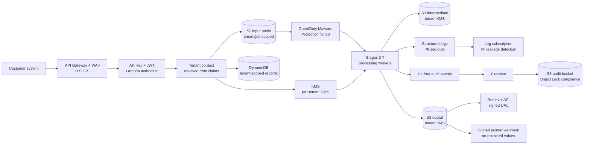
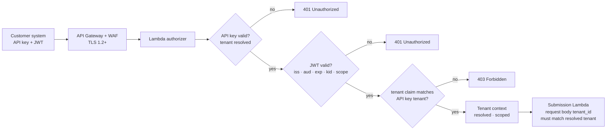

# Artifact 3 — Security and Compliance Posture

> **In one sentence:** Customer content lives only in tenant-CMK-encrypted artifacts and never in logs, webhooks, or audit records — this single separation is what reconciles GDPR erasure with SOC 2 immutable audit, and lets crypto-shredding (disabling the tenant CMK) act as a single deletion lever across all of a tenant's data.
>
> **Related artifacts:** Artifact 1 describes the system architecture. Artifact 2 covers operational alerts and security monitoring. Artifact 4 covers compliance-adjacent risks. Specific data flows are detailed in stage docs `stage-1` through `stage-7`.

## 1. What We Are Protecting

The platform processes sensitive customer documents: invoices, contracts, forms, and corporate reports. These documents can contain personal data, financial identifiers, legal terms, tax IDs, signatures, emails, addresses, and confidential business information.

The security posture is built around five principles:

- Tenant isolation is enforced everywhere, not only at the API boundary.
- Customer content is encrypted with tenant-scoped keys.
- Logs and audit records are useful without becoming another copy of the document.
- Immutable audit and GDPR erasure are reconciled by keeping audit records PII-free.
- Model output is treated as untrusted and cannot decide security, billing, retention, routing, or delivery behavior.

## 2. Case Study Interpretation and Scope

The case study asks for GDPR and SOC 2 alignment, KMS encryption, 365-day retention, automatic PII detection/masking, X-Ray tracing, and operational evidence through CI/CD and canary controls.

This artifact covers:

- Authentication and authorization.
- Tenant isolation.
- KMS encryption.
- S3 bucket policies and TLS.
- PII-safe logging.
- Immutable audit.
- GDPR access and erasure.
- SOC 2 evidence.
- Secure model interaction.
- Webhook and result retrieval security.

This artifact is a security design posture, not a legal certification. Final SOC 2 controls, retention exceptions, and GDPR legal bases must be reviewed with compliance/legal stakeholders before production.

## 3. Security Assumptions

| Area | Assumption |
|---|---|
| Tenancy | v1 has base-level tenants only, but all data, keys, quotas, schemas, prompts, jobs, and metrics are tenant-scoped. |
| Identity | Customer API calls use API key plus short-lived signed JWT bearer token. |
| JWT issuer | JWTs are issued by the platform identity service backed by Cognito or an approved OIDC IdP. |
| Data residency | Primary region is `us-east-1`; cross-region processing is deferred until residency requirements are known. |
| Encryption | Customer document data uses per-tenant KMS CMKs. Audit storage uses a separate platform-managed KMS boundary. |
| Audit | Immutable audit records are operational facts only and must not contain raw PII, document text, filenames, extracted values, or presigned URLs. |
| Retention | Inputs and final outputs are retained for 365 days by default; original inputs move to cold storage after 7 days. |
| Logs | Logs are structured, scrubbed at emit time, and inspected for leakage after emission. |
| Webhooks | Customers use pre-registered webhook endpoints only. Payloads are pointer-only and signed. |
| Model path | OCR text and prompts are treated as sensitive and untrusted. Bedrock Guardrails are mandatory for model calls. |

## 4. Security Architecture



Security is layered:

| Layer | Primary control |
|---|---|
| API edge | WAF, TLS 1.2+, API key, signed JWT, authorizer. |
| Tenant context | Tenant resolved from credential claims, never trusted from request body alone. |
| Storage | Tenant/job-scoped S3 keys, block public access, SecureTransport deny, tenant CMKs. |
| Processing | Least-privilege IAM, encryption context, tenant/job prefix checks, deterministic artifact contracts. |
| Model use | Guardrails, prompt injection controls, schema-constrained output, citation validation. |
| Logs | Emit-time scrubbing and post-emission leakage detection. |
| Audit | PII-free EventBridge to Firehose to S3 Object Lock compliance mode. |
| Delivery | Signed URLs from authenticated API, HMAC-signed pointer webhooks. |

## 5. Compliance Traceability

| Requirement | Control |
|---|---|
| Encrypt data at rest using KMS CMKs | Inputs, intermediates, prompts, model outputs, final outputs, review artifacts, and poison diagnostics are encrypted using tenant CMKs. |
| Encrypt data in transit | API Gateway TLS 1.2+, S3 `aws:SecureTransport` deny, HTTPS-only webhooks, AWS service TLS. |
| 365-day retention | Stage 7 lifecycle policy retains original inputs and final outputs for 365 days by default; inputs cold-tier after 7 days. |
| Separate input/intermediate/output/audit storage | Separate buckets/prefixes and policies for original input, intermediate artifacts, durable output, and immutable audit. |
| Least-privilege IAM | Processing roles are scoped to tenant/job prefixes, KMS key conditions, and required service actions. |
| Automatic PII masking in logs | Structured logger scrubs email, SSN-like values, phone numbers, access tokens, presigned URLs, and filenames before emission. |
| PII leakage detection | CloudWatch Logs subscription filter routes suspicious logs to Comprehend-backed inspection Lambda. |
| Redacted outputs | Stage 6 creates `customer-result.json` according to tenant output policy; full result remains access-controlled. |
| GDPR access | Stage 7 retrieval index maps tenant/job to retained artifacts for access and export workflows. |
| GDPR erasure | Deletion workflow removes customer content objects, indexes, unsafe webhook payload records, and can crypto-shred through tenant key deletion where contractually allowed. |
| Immutable audit | Audit events go through EventBridge and Firehose to S3 Object Lock in compliance mode. |
| SOC 2 change management | CDK Python, GitHub Actions, tests, CDK synth, security checks, canary, rollback evidence. |
| Customer data access logs | Retrieval API and operator/support access emit PII-free audit events with actor, tenant, job, purpose, timestamp, and artifact hash. |
| Multi-tenant isolation | Tenant-scoped KMS, S3 prefixes, DynamoDB keys, prompt/schema registry, quotas, cost ledger, metrics, and authorization checks. |
| X-Ray tracing | Correlation ID, tenant ID, job ID, chunk ID, and stage propagated through asynchronous boundaries. |

## 6. Identity and Access

### 6.1 Customer Authentication



Customer-facing APIs require both:

- API key: identifies tenant/application and supports coarse rate limiting.
- Signed JWT bearer token: carries issuer, audience, expiry, tenant claim, scopes, and key ID.

JWT controls:

- Use asymmetric signing (`RS256` or `ES256`).
- Publish verification keys through JWKS.
- Keep JWT lifetime short, typically 5-15 minutes for machine-to-machine calls.
- Store signing keys in KMS or Secrets Manager.
- Rotate keys with overlapping validity windows.
- Validate `iss`, `aud`, `exp`, `kid`, tenant claim, and scopes.

Tenant resolution rule:

The platform resolves tenant from API key and JWT claims. It never trusts `tenant_id` from the request body unless it matches the authenticated tenant context.

### 6.2 Operator Access

Operator/support access is separate from customer APIs.

Controls:

- SSO-backed access.
- Role-based permissions.
- Just-in-time elevated access for sensitive support tasks.
- Mandatory reason code for customer data access.
- PII-free audit event for every access.
- No access to `final-result.json` or validation reports through normal customer APIs.

## 7. Tenant Isolation

Tenant isolation is enforced at every layer:

| Layer | Isolation mechanism |
|---|---|
| API | Authorizer resolves tenant and scopes every request. |
| S3 | Tenant/job-scoped keys; platform-generated object keys; block public access. |
| KMS | Per-tenant CMK for customer document data and derived artifacts. |
| DynamoDB | Job IDs as high-cardinality primary keys; tenant indexes are sharded; all reads verify tenant ownership. |
| Prompts/schemas | Tenant schema registry and prompt policy are scoped by tenant/schema/version. |
| Quotas | Token buckets and concurrency counters are tenant-scoped. |
| Webhooks | Jobs reference pre-registered `webhook_id`; arbitrary URLs are not accepted in v1. |
| Metrics/cost | Cost, quality, and operational metrics are attributed per tenant without using raw tenant IDs as high-cardinality metric dimensions. |

Per-tenant CMK is the core boundary. IAM alone is not sufficient for a SaaS platform that must support GDPR erasure and strong tenant separation.

## 8. Data Protection

### 8.1 S3 Controls

All buckets enforce:

- Block public access.
- Deny non-TLS access with `aws:SecureTransport=false`.
- Server-side encryption with tenant KMS key for customer data.
- Bucket policies that prevent cross-tenant prefix access.
- Platform-generated object keys.
- Lifecycle policies by data class.

Presigned upload policy requires:

- Maximum content length.
- Exact content type for PDF.
- Checksum metadata.
- Tenant/job metadata.
- `x-amz-server-side-encryption=aws:kms`.
- Expected `x-amz-server-side-encryption-aws-kms-key-id`.

### 8.2 KMS Controls

Controls:

- Tenant configuration stores `tenant_kms_key_arn`.
- Workers decrypt only in the context of the current tenant/job.
- Encryption context includes tenant/job where supported.
- Textract async calls pass `OutputConfig` with tenant-scoped S3 bucket/prefix and tenant KMS key.
- On GDPR erasure, customer objects are deleted and tenant key deletion/disablement is scheduled when legally allowed.

### 8.3 Data Classes

| Data class | Examples | Protection |
|---|---|---|
| Input | Original PDF | Tenant CMK, 365-day retention, cold-tier after 7 days. |
| Intermediate | OCR text, enhanced images, prompts, model outputs | Tenant CMK, short lifecycle unless needed for retry/review. |
| Final internal | `final-result.json`, `validation-report.json` | Tenant CMK, access-controlled, not exposed through customer APIs in v1. |
| Customer output | `customer-result.json` | Tenant CMK, redacted by policy, retrievable through signed URL. |
| Audit | State transitions, actor, hashes, reason codes | PII-free, Object Lock compliance mode, separate KMS boundary. |
| Logs | Operational events and errors | PII scrubbed, leakage detection, no raw text or extracted values. |

## 9. PII Protection

PII controls are preventive and detective.

Preventive controls:

- Do not log raw document text.
- Do not log extracted field values.
- Do not log original filenames because filenames often contain PII.
- Do not log presigned URLs.
- Do not put raw PII in immutable audit.
- Redact customer-facing output according to tenant policy.
- Keep webhook payloads pointer-only.

Detective controls:

- Structured logging library scrubs likely PII before logs leave the process.
- CloudWatch Logs subscription filter inspects log streams for leakage.
- Comprehend-backed detection flags emails, SSNs, and similar sensitive patterns.
- `pii_log_detection_count` and alerting drive incident response.

Redaction behavior:

- Validation runs before redaction.
- Redaction failure blocks delivery.
- Fields without explicit redaction policy flow through unchanged.
- Fields with policy are masked, suppressed, or value-hidden.
- Full unredacted result stays only in access-controlled internal artifact.

## 10. Immutable Audit and GDPR Erasure

SOC 2 wants durable audit evidence. GDPR requires deletion of customer content. The reconciliation is simple: audit records must not contain customer content.

Audit path:

```text
Application audit event -> EventBridge -> Firehose -> S3 audit bucket with Object Lock
```

Audit records can contain:

- Tenant ID.
- Job ID.
- Actor or service role.
- Event type.
- Previous and new state.
- Timestamp.
- Request ID.
- Artifact hash.
- Object key hash.
- Reason code.
- Policy/schema/model versions.
- Counts and timings.

Audit records must not contain:

- Raw document text.
- Extracted values.
- Filenames.
- Emails.
- SSNs.
- Presigned URLs.
- Prompt text.
- Model responses.

GDPR erasure workflow:

1. Mark job `DELETION_REQUESTED`.
2. Stop processing, replay, and webhook delivery for the job.
3. Delete input, intermediate, final, and customer output artifacts from their respective S3 buckets.
4. Delete retrieval index entries and any webhook delivery payload records that contain customer content beyond audit-safe IDs.
5. Crypto-shred tenant data when contract and legal hold allow: disabling or scheduling deletion of the tenant KMS CMK makes all encrypted artifacts unreadable without requiring individual object deletion at scale.
6. Mark job `DELETED`.
7. Keep PII-free immutable audit record as security evidence — this record contains no customer content and is explicitly excluded from erasure scope.

If legal hold blocks deletion, the job is marked deletion-restricted with a PII-free reason code and routed through the support/compliance workflow.

## 11. Model Security

OCR text and customer documents are untrusted input. The model must not be able to control infrastructure decisions.

Model safeguards:

- Bedrock Guardrails are mandatory for v1 model invocations.
- Prompt injection instructions inside documents are treated as data, not commands.
- Prompt package excludes secrets, auth material, original PII-bearing filenames, and unrelated tenant content.
- Model output must call the expected tool exactly once.
- Free-form output is ignored and treated as invalid.
- Every non-null extracted value must cite source spans.
- Missing or invalid citations reject the field.
- Model output cannot decide webhook destination, billing status, retention, S3 keys, IAM permissions, or whether critical conflicts can be ignored.

Few-shot retrieval:

- Tenant-scoped examples are preferred.
- Platform-curated examples must be PII-free.
- Retrieval filters by tenant, schema, document type, and prompt major version.
- Cross-tenant private examples are not used in v1.

## 12. Retrieval and Webhook Security

### 12.1 Retrieval API

The customer result is retrieved through an authenticated API:

- Customer calls `GET /v1/jobs/{job_id}/result`.
- API validates tenant ownership.
- API returns metadata and a short-lived signed URL for `customer-result.json`.
- Signed URL TTL defaults to 15 minutes.
- Full internal result and validation report are not exposed through v1 customer APIs.

### 12.2 Webhooks

Webhook controls:

- Pre-registered endpoints only.
- HTTPS only.
- Per-webhook secret stored in Secrets Manager.
- HMAC-SHA256 signature.
- Timestamp and event ID headers.
- Replay protection by event ID and timestamp.
- Pointer-only payload.
- No extracted values, raw text, validation internals, PII, or presigned S3 URLs.

Webhook failure does not change the job result. It affects only delivery state and support workflow.

## 13. SOC 2 Evidence Model

| SOC 2 concern | Evidence produced |
|---|---|
| Change management | GitHub Actions runs tests, coverage, security checks, CDK synth, and canary rollout records. |
| Access control | IAM policies, API authorizer logs, operator access audit events, support reason codes. |
| Encryption | KMS key policies, S3 encryption config, object metadata validation. |
| Availability | SLO dashboards, incident records, DLQ/replay history, provider outage runbooks. |
| Processing integrity | Artifact hashes, state transitions, schema/prompt/model versions, citation validation outcomes. |
| Confidentiality | PII-safe logs, tenant CMK use, webhook pointer-only payloads, redaction policy evidence. |
| Privacy | GDPR access/deletion workflow records, retention lifecycle config, PII-free audit separation. |

## 14. Security Operations

Required alerts:

- Unauthorized access attempts.
- WAF anomalies.
- KMS decrypt/encrypt failures.
- Cross-tenant access denials.
- S3 public access or bucket policy drift.
- PII detected in logs.
- GuardDuty malware detection.
- Guardrail bypass or break-glass usage.
- Webhook signature failures.
- Operator access without valid reason code.
- GDPR deletion stuck or legal-hold blocked.

Required incident responses:

- PII leakage in logs.
- Malware upload detected.
- KMS/IAM policy regression.
- Suspected cross-tenant access attempt.
- Webhook secret rotation.
- Tenant erasure request.
- Bedrock guardrail failure or prompt-injection spike.
- Audit delivery failure.

## 15. Closing Thoughts

The security design keeps customer content in tenant-encrypted artifacts, not in logs, webhooks, or immutable audit records. This separation is what lets the platform satisfy both auditability and deletion requirements.

The strongest control is consistency: every stage resolves tenant context, verifies artifact ownership, writes PII-free audit events, and keeps model output away from infrastructure decisions.

## 16. Glossary

| Term | Meaning |
|---|---|
| CMK | Customer-managed KMS key. |
| Crypto-shredding | Making encrypted data unreadable by deleting or disabling the encryption key. |
| GDPR erasure | Deletion workflow for customer content and indexes subject to legal/contract constraints. |
| Immutable audit | Tamper-resistant audit records stored with S3 Object Lock. |
| JWKS | JSON Web Key Set used to publish public keys for JWT verification. |
| PII | Personally identifiable information, such as email, SSN, phone, address, or tax identifiers. |
| SecureTransport | S3 condition key used to deny non-TLS access. |
