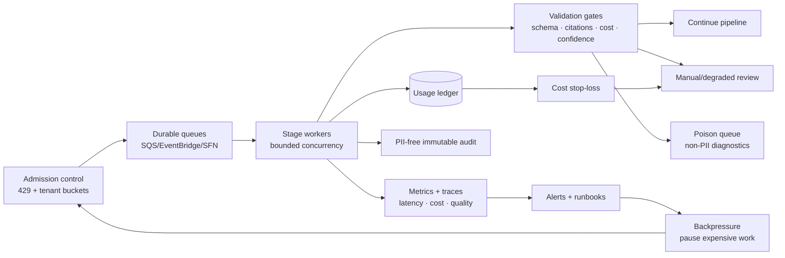

# Artifact 4 — Risk Mitigation Plan

> **In one sentence:** The platform admits where automation should stop — documents that can't safely meet latency or cost targets get delayed, reviewed, downgraded, or rejected, rather than silently reducing quality to hit a number.
>
> **Related artifacts:** Artifact 1 describes the controls that prevent risks. Artifact 2 describes the operational signals that detect them. Artifact 3 covers security-specific risks. Full risk register is in Section 5 below; detection signals and runbook patterns are tied to dashboards in Artifact 2.

## 1. What This Plan Covers

This plan identifies the major risks in the Document AI platform and explains how the architecture prevents, detects, contains, and recovers from them.

### The case study's named risks

The case study Section 6 explicitly names three risks for the Risk Mitigation Plan deliverable. These get top billing here:

| Case study risk | Where it lives in this artifact | Headline mitigation |
|---|---|---|
| **Service quotas** | Risk R5–R7, R11–R13; Section 8 quota table | Bounded concurrency at global / tenant / job level; quota increase requests as launch gates; circuit breakers + backpressure when limits are hit. |
| **Cost overruns** | Risk R3, R4; Section 7 cost exception policy | Page routing avoids OCR for digital text; structured OCR is schema-gated (form OCR is 4× the price of text); per-stage stop-loss thresholds; `cost_policy_result` exposes exceptions rather than hiding them. |
| **Model hallucination** | Risk R9, R10; Section 9 quality mitigations | Mandatory source citations on every non-null field; tool-use forces schema-valid JSON; deterministic validators own all consequential decisions; critical conflicts route to manual inspection rather than model guessing. |

### Broader risk landscape

Beyond the case study's three, the following risk categories are addressed:

- Missing the 5-minute P95 latency target (R1, R2).
- Tenant fairness during 50K burst (R11).
- DynamoDB hot partitioning (R12).
- Duplicate work from retries (R13).
- Poison documents blocking queues (R14).
- PII leakage in logs (R15).
- Immutable audit conflicting with GDPR erasure (R16).
- Webhook endpoint failures (R17).
- Self-hosted GPU underperforming (R18, R19).
- Release regressions in prompt/schema/model (R20).

The plan is intentionally practical. Each risk has design controls, detection signals, and a response path.

## 2. Case Study Interpretation and Scope

The case study explicitly calls out service quotas, cost overruns, and model hallucinations. It also implies risks around Lambda limits, 128K context windows, burst traffic, provider outages, GPU orchestration, and compliance.

This artifact covers:

- Risk register for the full seven-stage pipeline.
- Mitigations for technical, operational, ML, cost, security, and compliance risks.
- Early warning signals.
- Runbooks and escalation paths.
- Residual risk that should remain visible in the interview discussion.

This artifact does not replace final load testing, security review, manual pricing validation, or model evaluation. Those are launch readiness gates.

## 3. Risk Assumptions

| Area | Assumption |
|---|---|
| Latency | Stage budgets: S2 ≤30s, S3 P95 ≤180s, S4 P95 ≤60s, S5 P95 ≤30s, S6/S7 ≤10s each. Queue age and critical-path tracing validate these in production; stage P95s alone are not sufficient. |
| Cost | Representative-mix target: ~$0.10/100 pages (ingestion ~$0.04, OCR ~$0.01–0.03, extraction ~$0.017, merge/synthesis ~$0.011, delivery ~$0.003). Cost controls must work even when document mix or pricing shifts. |
| Document mix | Representative mix: ~60% digital-text, ~30% hybrid, ~10% scanned. Fully scanned and structured-OCR-heavy documents are cost-policy exceptions. |
| Tenants | v1 has base-level tenants only, but fairness controls are still required. |
| Providers | Textract and Bedrock are single-provider managed dependencies in v1. |
| Recovery | Automated recovery is bounded. Repeated or deterministic failures go to manual inspection or poison queues. |
| Model output | Model output is untrusted until schema, citation, confidence, and business-rule validation pass. |
| Security | PII must not appear in logs, immutable audit records, or webhooks. |

## 4. Risk Control Architecture

The platform mitigates risk through layered controls:

| Control | Purpose |
|---|---|
| Admission control | Prevent accepting work that cannot be processed fairly or within current capacity. |
| Durable queues | Buffer bursts and provider slowdowns without losing jobs. |
| Bounded concurrency | Prevent service quota exhaustion and tenant starvation. |
| Idempotency | Make retries safe and prevent duplicate billing, OCR starts, model calls, and webhooks. |
| Cost stop-loss | Stop or require approval before expensive OCR/model paths exceed policy. |
| Validation gates | Block hallucinated, uncited, low-confidence, or conflicting outputs. |
| DLQs and poison queues | Isolate repeated failures so they do not block healthy traffic. |
| Manual review | Provide a safe path for critical ambiguity and non-automatable decisions. |
| Observability | Detect drift in latency, quality, cost, and provider health early. |

## 5. Risk Register

| # | Risk | Impact | Likelihood | Mitigation | Detection |
|---|---|---|---|---|---|
| R1 | P95 latency exceeds 5 minutes | Misses core case study target | Medium | Queue-age alarms, bounded concurrency, OCR/model backpressure, parallel chunk fan-out, manual SLA validation. | End-to-end P95, slowest required chunk trace, stage queue age. |
| R2 | 1,000-page low-quality scan exceeds latency budget | Long tail delays and customer dissatisfaction | High | Mark scanned-heavy as P95-tail risk, process chunks in parallel, route cost/latency exceptions through policy. | Stage 2 scanned-page ratio, Stage 3 callback latency, queue age. |
| R3 | Cost exceeds $0.10/100 pages | Unit economics fail | High for scanned-heavy docs | Page routing, OCR bypass, structured OCR gating, token caps, stop-loss, representative-mix reporting. | Cost per 100 pages, OCR page count, token usage, cost_policy_result. |
| R4 | Structured OCR used too broadly | Severe cost overrun | Medium | Default raw OCR only; schema selectors required for Forms/Tables; approval when projected cost exceeds ceiling. | Structured OCR page count, structured OCR cost spike. |
| R5 | Bedrock throttling or quota exhaustion | Stage 4 backlog and SLA misses | Medium | Per-tenant/job/global concurrency, quota requests, retries with jitter, circuit breaker, backpressure. | Model throttle rate, model queue age, TTFT, Bedrock error rate. |
| R6 | Textract throttling or outage | OCR backlog and SLA misses | Medium | Async OCR, callback/poll fallback, circuit breaker, admission backpressure, manual terminal policy for long outage. | Textract throttles, callback timeout rate, OCR queue age. |
| R7 | Lambda limits on large PDFs | Timeouts and failed preprocessing | High if Lambda-only | Lambda only for ≤250 pages/≤100 MB; ECS/Fargate for large/heavy PDFs. | Lambda timeout/memory/tmp errors, Fargate fallback count. |
| R8 | LLM context overflow | Failed extraction or truncated prompts | Medium | Token-aware chunking, 30K hard cap, local tokenizer, sub-split policy, bounded synthesis. | Token cap exceeded, sub-split requests, prompt build failures. |
| R9 | Model hallucination | Incorrect customer output | High without controls | Tool-use schema, citation required for non-null values, confidence thresholds, deterministic validators, manual review. | Citation failure rate, field F1, manual-review rate, hallucination labels. |
| R10 | Critical field conflict | Wrong invoice totals, parties, dates, clauses | Medium | Deterministic conflict policy; critical high-confidence conflicts route to manual inspection. | Critical conflict count, invoice total conflict rate. |
| R11 | One tenant starves others | Fairness and availability risk | Medium | Tenant token buckets, per-tenant concurrency, sharded counters, 429 with retry guidance. | Tenant queue share, rate-limited count, active jobs per tenant. |
| R12 | DynamoDB hot partition | State write throttling during burst | Medium | High-cardinality job PK, sharded tenant indexes and quota counters. | DDB throttles, partition hot key signals, write latency. |
| R13 | Duplicate S3 events or retries cause duplicate work | Duplicate charges and inconsistent state | High without idempotency | Stage-specific idempotency keys and conditional writes. | Conditional conflict rate, duplicate event count, billing reconciliation. |
| R14 | Poison document blocks queue | Backlog and retry storm | Medium | Retry budgets, poison queues, compact diagnostics, operator replay tooling. | Retry exhaustion, poison queue depth, repeated failure reasons. |
| R15 | PII leaks into logs | Compliance incident | Medium | Emit-time scrubbing, no raw text/values, log subscription leakage detection. | PII detection alerts, suspicious log patterns. |
| R16 | Immutable audit conflicts with GDPR erasure | Compliance gap | Medium | Audit stores only PII-free operational facts; content stays in erasable tenant artifacts. | Audit schema validation, DSR deletion checks. |
| R17 | Webhook endpoint failure | Customer not notified | High, customer-controlled | Pointer-only webhooks, retries over 24h, DLQ, result availability independent of webhook success. | Webhook retry exhaustion, endpoint 4xx/5xx, signature failures. |
| R18 | Self-hosted GPU underperforms | Higher cost and latency than Bedrock | Medium | Without INT8/FP8 quantization, A10G achieves only ~500 tokens/sec — cheaper per token than Bedrock requires ≥825 tokens/sec at 80% utilization. Benchmark with production-representative 18K-token prompts before cutover. Recommended switch at ~10,000 docs/day (~5,500 break-even; 10K provides margin for operational variability). Keep Bedrock fallback. | Tokens/sec, GPU utilization, cost/1M tokens vs Bedrock $0.22/1M, TTFT. |
| R19 | Spot GPU interruption | In-flight model work lost | Medium | Drain on interruption notice, requeue idempotently, on-demand overflow. | Spot interruption events, requeued model work, latency impact. |
| R20 | Prompt/schema/model release regression | Quality/cost/latency regression | Medium | Versioning, offline eval, 10% canary, rollback. | Critical-field F1, schema failures, token spikes, cost spikes. |

## 6. Latency Risk Mitigation

Latency risk comes from two sources: processing time and waiting time. Processing time is the actual work. Waiting time is queue age caused by bursts, throttles, provider limits, or tenant contention.

Mitigations:

- Exclude upload time from the platform SLA; measure from `accepted_at`.
- Use S3 Transfer Acceleration to reduce upload bottlenecks even though upload time is outside SLA.
- Fan out chunks with Step Functions Distributed Map.
- Track slowest required chunk as the true critical path.
- Avoid OCR for direct-text pages.
- Avoid image enhancement for clean digital PDFs.
- Use async OCR callbacks and poll fallback.
- Apply admission backpressure when queue age threatens SLA.
- Keep Stage 5/6/7 deterministic and fast.

Early warning signals:

- Stage 2 processing time above typical budget.
- Stage 3 callback latency > expected window.
- Stage 4 model queue age increasing.
- Bedrock or Textract throttles.
- Per-tenant active job imbalance.
- Manual-review backlog for critical fields.

Residual risk:

Fully scanned, low-quality, 1,000-page documents can be outside representative P95. The platform must label them as tail-risk/cost-exception workloads rather than pretending every such document fits the same SLA.

## 7. Cost Risk Mitigation

Cost risk is dominated by OCR and model tokens.

Mitigations:

- Classify pages before OCR.
- Use embedded text when valid.
- Use region-level OCR for hybrid pages when coordinates are reliable.
- Default structured OCR off unless schema selectors require it.
- Estimate cost before starting paid OCR/model work.
- Track actual usage after each stage.
- Apply soft and hard stop-loss thresholds.
- Skip optional document summaries when synthesis would exceed policy.
- Treat platform recovery as non-billable but still visible in ledger.

Cost exception policy:

| Condition | Response |
|---|---|
| Scanned-heavy document exceeds representative budget | Mark `MIX_EXCEPTION`, continue only if tenant/job policy allows. |
| Structured OCR projected above ceiling | Downgrade to raw OCR where safe or route to approval/manual inspection. |
| Token usage exceeds cap | Sub-split chunk or route to manual inspection; do not silently truncate. |
| Stronger-model recovery would exceed stop-loss | Use only for critical fields or route to manual inspection. |
| Retry storm increases cost | Stop automated retry and isolate poison item. |

Residual risk:

The $0.10 target holds for the representative mix at current pricing (Textract $0.0010/page text/table at volume, Llama 3.1 8B $0.22/1M tokens). Scanned-heavy documents or structured OCR usage can push per-document cost well above target — the architecture makes this visible through `cost_policy_result` tracking rather than hiding it in aggregate averages.

## 8. Service Quota and Burst Risk

The 50,000-document burst cannot be allowed to become 50,000 simultaneous OCR or model calls.

Mitigations:

- Admission control at API and tenant level.
- Separate created jobs from accepted jobs.
- Quota consumed only after accepted upload.
- Per-stage concurrency controls.
- Tenant token buckets.
- Distributed Map max concurrency.
- SQS buffering for callbacks and handoffs.
- Quota increase requests as launch readiness items.

Quota risk table:

| Service | Risk | Mitigation |
|---|---|---|
| Textract | Async OCR job limits and throttles | OCR admission control, active OCR unit caps, circuit breaker. |
| Bedrock | RPM/token quotas | Model concurrency caps, quota increase requests, backpressure. |
| Step Functions | Map concurrency and transition pressure | Distributed Map with configured concurrency and Express children where appropriate. |
| DynamoDB | Hot partitions and write throttles | High-cardinality job PK, sharded tenant/quota counters, on-demand mode. |
| S3 | Request hot prefixes | Tenant/job-scoped keys with high-cardinality distribution. |
| Lambda | Concurrency and timeouts | Reserved concurrency where needed; Fargate for heavy PDFs. |
| Webhooks | Customer endpoint failures | Async dispatcher, retries, DLQ, result available independently. |

## 9. Model Hallucination and Quality Risk

The model can produce plausible but wrong data. The platform therefore treats model output as a proposal, not truth.

Mitigations:

- Tool-use structured output; free-form text is invalid.
- JSON Schema validation.
- Required source citations for every non-null value.
- Citation resolver validates page/block/span against current Stage 3 artifacts.
- Confidence thresholds route critical failures to stronger model or manual inspection.
- Invoice totals and high-value fields use deterministic validators.
- Merge refuses to guess critical conflicts.
- Stage 6 rejects invalid citations and unresolved critical fields.

Quality monitoring:

- Document-level precision/recall/F1.
- Field-level precision/recall/F1.
- Critical-field F1.
- Citation validity.
- Schema validation success.
- Manual-review precision/recall.
- Not-found accuracy.
- Hallucination-related review rate.

Residual risk:

Some fields require business judgment or ambiguous interpretation. The correct mitigation is manual inspection or domain-approved schema policy, not unconstrained model prompting.

## 10. Security and Compliance Risk

Security risk is highest at boundaries: upload, logs, model prompts, audit, webhooks, and operator access.

Mitigations:

- API key plus signed JWT.
- WAF and TLS 1.2+.
- S3 SecureTransport deny.
- Per-tenant KMS CMKs.
- GuardDuty malware gate before acceptance.
- Emit-time log scrubbing.
- CloudWatch log leakage detection.
- PII-free immutable audit.
- Redacted customer outputs.
- Pointer-only signed webhooks.
- Operator access through separate audited tooling.

Compliance risk table:

| Risk | Mitigation |
|---|---|
| Malware enters pipeline | GuardDuty scan gates acceptance. |
| PII in logs | No raw content logging, scrubber, leakage detector, alerting. |
| Audit contains PII | Audit schema only allows IDs, hashes, counts, timings, statuses, reason codes. |
| GDPR erasure incomplete | Stage 7 deletion workflow removes content artifacts and indexes; audit remains PII-free. |
| Cross-tenant read | Tenant authorization, S3 prefix checks, per-tenant KMS, IAM conditions. |
| Webhook leaks data | Pointer-only payload; no extracted values or presigned URLs. |
| Model controls infrastructure | Deterministic code owns billing, routing, retention, webhook, IAM, and S3 keys. |

## 11. Provider Outage Risk

V1 relies on managed Textract and Bedrock in the primary region. This is simpler and launchable, but it creates provider-dependency risk.

Textract outage response:

1. Open Stage 3 circuit breaker.
2. Stop starting new OCR jobs.
3. Keep accepted chunks queued when policy allows.
4. Apply Stage 1 admission backpressure for OCR-heavy work.
5. Move jobs to retryable or manual states if customer policy requires terminal updates.
6. Preserve replay eligibility.

Bedrock outage response:

1. Open Stage 4 model circuit breaker.
2. Stop new model invocations.
3. Apply model queue backpressure.
4. Use retry budget with jitter.
5. Route critical work to evaluated alternate model only if available and policy-approved.
6. Otherwise route to manual inspection or wait in queued state.

Residual risk:

Cross-region failover is deferred to v2 because it complicates KMS isolation, data residency, callbacks, quotas, and audit evidence. The v1 mitigation is clear backpressure and predictable degradation.

## 12. Self-Hosted Inference Risk

Self-hosted LLMs can lower cost at scale but add operational risk.

Risks:

- GPU utilization too low to beat Bedrock.
- vLLM throughput lower than expected with long prompts.
- Spot interruptions increase tail latency.
- Karpenter node provisioning is slower than queue growth.
- Model quality differs from managed route.
- GPU cluster adds security and patching surface.

Mitigations:

- Do not launch self-hosted path until benchmarked with production-like prompts.
- Compare managed and self-hosted quality with the same eval set.
- Keep Bedrock fallback.
- Use KEDA for model-server scaling and Karpenter for node provisioning.
- Use reserved baseline plus spot burst plus on-demand overflow.
- Track cost per 1M tokens in Grafana.
- Require self-hosted route to pass latency, cost, citation, schema, and F1 gates before traffic cutover.

Cutover criteria:

- Sustained volume is at or above ~10,000 docs/day.
- vLLM benchmarks with production-representative 18K-token prompts confirm ≥825 tokens/sec at ≥80% GPU utilization on the A10G — the threshold where reserved instance cost beats Bedrock's $0.22/1M rate.
- Critical-field F1 is not worse than the Bedrock route on the eval set.
- P95 and TTFT meet stage SLOs.
- Operational team can respond to GPU incidents, spot interruptions, and Karpenter provisioning delays.
- Rollback to Bedrock is tested and confirmed to complete without affecting in-flight jobs.

## 13. Manual Inspection Risk

Manual review is necessary, but it can become a bottleneck.

Mitigations:

- Separate degraded-review queue from critical manual-inspection queue.
- Keep interim artifacts and reason codes.
- Prioritize critical fields and high-value customers/jobs.
- Track backlog age and reviewer throughput.
- Use reviewed artifacts to improve eval datasets and schema policies.
- Do not block non-critical optional fields if schema coverage thresholds are met.

Manual review triggers:

- Low-confidence critical page/field after recovery.
- Critical field missing or uncited.
- High-confidence conflict on critical singleton field.
- Invoice total conflict.
- Unsupported critical page.
- Cost stop-loss requiring approval.
- Repeated deterministic failure.

## 14. Launch Readiness Checklist

| Area | Gate |
|---|---|
| Latency | Load test validates final P95 model against expected document mix. |
| Cost | Manual pricing model validated against current AWS prices and representative documents. |
| Quotas | Textract, Bedrock, Step Functions, Lambda, DynamoDB, and S3 quotas reviewed; increase requests filed. |
| Idempotency | Duplicate job, S3 event, OCR callback, model retry, merge replay, and webhook replay tests pass. |
| Security | KMS/IAM policies, S3 bucket policies, WAF, JWT validation, webhook signatures, and PII log controls tested. |
| GDPR | Access and erasure workflow tested for input, intermediate, output, indexes, and audit separation. |
| MLOps | Baseline eval set, prompt/schema/model versioning, canary, rollback, and quality dashboards ready. |
| Runbooks | Outage, DLQ, poison, cost overrun, PII leak, KMS failure, webhook failure, and GPU interruption runbooks ready. |
| Observability | Dashboards and alerts verified in staging with synthetic failures. |

## 15. Closing Thoughts

The safest part of this design is that it admits where automation should stop. Some documents should be delayed, reviewed, downgraded, or rejected rather than forcing the platform to meet latency or cost targets by silently reducing quality.

The core mitigation pattern is consistent across the system: estimate before expensive work, validate after probabilistic work, isolate repeated failures, and make every decision observable.

## 16. Glossary

| Term | Meaning |
|---|---|
| Backpressure | Slowing or rejecting new work when downstream capacity is at risk. |
| Circuit breaker | Mechanism that temporarily stops calls to an unhealthy dependency. |
| Cost stop-loss | Policy threshold that prevents uncontrolled spend. |
| Critical path | Slowest required chain of work that determines job completion time. |
| Poison queue | Queue for repeatedly or deterministically failing items that need review. |
| Representative mix | Expected blend of digital, hybrid, and scanned pages used for cost/latency planning. |
| Residual risk | Risk that remains after mitigations and must be accepted or tracked. |
